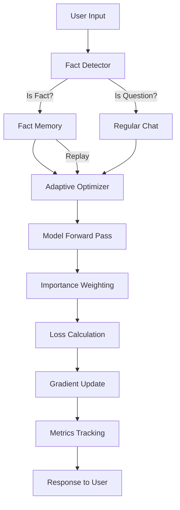

# System Documentation: Online Learning LLM with Enhanced Fact Acquisition

## Table of Contents

1. [System Overview](#system-overview)
2. [Architecture](#architecture)
3. [Core Components](#core-components)
4. [Enhanced Learning Features](#enhanced-learning-features)
5. [Technical Deep Dive](#technical-deep-dive)
6. [Configuration System](#configuration-system)
7. [Technologies & Techniques](#technologies--techniques)
8. [Data Flow & Execution](#data-flow--execution)
9. [Research Metrics](#research-metrics)
10. [Contributing & Extending](#contributing--extending)

---

## System Overview

This project implements a **true online learning system** for Large Language Models (LLMs) that updates model weights after every user interaction. Unlike traditional batch training, this system performs gradient descent immediately after each chat turn, enabling real-time adaptation to user preferences and facts.

### Key Innovation

The system combines:
- **True Online Gradient Descent**: Updates after every interaction (no batching)
- **LoRA (Low-Rank Adaptation)**: Parameter-efficient fine-tuning with minimal trainable parameters
- **Self-Distillation Loss**: KL divergence regularization to prevent catastrophic drift
- **Enhanced Fact Learning**: Fast fact acquisition through explicit training, importance weighting, and adaptive learning rates

### Research Applications

- **Continual Learning**: Study how models adapt to new information over time
- **Plasticity-Stability Tradeoff**: Balance between learning new facts and retaining old knowledge
- **Human-AI Co-adaptation**: Model personalization through interaction
- **Alignment Drift Analysis**: Measure how model behavior changes during online learning
- **Catastrophic Forgetting**: Study forgetting patterns in online settings

---

## Architecture

### High-Level Architecture

```
┌─────────────────────────────────────────────────────────────────┐
│                        User Interface                            │
│                    (CLI Chat Interface)                          │
└────────────────────────────┬────────────────────────────────────┘
                             │
                             ▼
┌─────────────────────────────────────────────────────────────────┐
│                    Online Trainer                                │
│  ┌──────────────────────────────────────────────────────────┐  │
│  │  Fact Detector → Fact Memory → Adaptive Optimizer        │  │
│  │  Importance Weighting → Loss Functions                   │  │
│  └──────────────────────────────────────────────────────────┘  │
└────────────────────────────┬────────────────────────────────────┘
                             │
                             ▼
┌─────────────────────────────────────────────────────────────────┐
│              Model Architecture                                  │
│  ┌──────────────────┐      ┌──────────────────┐               │
│  │  Frozen Base     │      │  LoRA Adapter    │               │
│  │  (Qwen2.5 0.5B)  │  +   │  (Rank 2-4)      │               │
│  │  (398MB)         │      │  (q_proj, v_proj)│               │
│  └──────────────────┘      └──────────────────┘               │
└────────────────────────────┬────────────────────────────────────┘
                             │
                             ▼
┌─────────────────────────────────────────────────────────────────┐
│              Metrics & Logging                                   │
│  Stability │ Plasticity │ Forgetting │ Checkpointing            │
└─────────────────────────────────────────────────────────────────┘
```

### Component Interaction Flow



---

## Core Components

### 1. Base Model Loader (`src/model/base_model.py`)

**Purpose**: Loads and freezes the base LLM (Qwen2.5 0.5B)

**Key Features**:
- Downloads model from HuggingFace on first run
- Freezes all base model parameters (`requires_grad=False`)
- Handles device placement (CPU/CUDA)
- Returns both model and tokenizer

**Technical Details**:
```python
# Model is loaded with torch_dtype=float16 for memory efficiency
# All parameters are frozen immediately after loading
for param in base_model.parameters():
    param.requires_grad = False
```

### 2. LoRA Adapter (`src/model/lora_adapter.py`)

**Purpose**: Applies Low-Rank Adaptation to specific model layers

**Key Features**:
- Configurable rank (2-4 recommended)
- Targets specific modules: `q_proj` and `v_proj` (query and value projections)
- Minimal trainable parameters (~0.1% of base model)
- Uses PEFT library from HuggingFace

**LoRA Mathematics**:
```
Original: W * x
LoRA:     (W + B * A) * x
          where A ∈ R^(d×r), B ∈ R^(r×d), r << d
```

**Why q_proj and v_proj?**
- These layers control attention mechanisms
- Small changes here have large impact on output
- More parameter-efficient than full fine-tuning

### 3. Online Trainer (`src/training/online_trainer.py`)

**Purpose**: Orchestrates the online learning loop

**Key Responsibilities**:
1. **Chat Processing**: Handles user input, generates responses
2. **Fact Detection**: Identifies factual statements vs questions
3. **Training Coordination**: Routes to fact training or regular training
4. **Fact Replay**: Periodically retrains on stored facts
5. **State Management**: Tracks turn count, loss history

**Core Method: `chat_and_update()`**

```python
def chat_and_update(self, user_input: str) -> Tuple[str, Dict[str, float]]:
    # 1. Detect if input is a fact
    is_fact, fact_info = self.fact_detector.detect(user_input)
    
    # 2. Generate response
    response = self.model.generate(user_input)
    
    # 3. Train based on context
    if is_fact:
        loss = self.train_on_fact(user_input, fact_info, response)
        self.fact_memory.store(user_input, fact_info, self.turn_count)
    else:
        loss = self.train_step(full_sequence, ...)
    
    # 4. Replay facts if needed
    if self.fact_memory.should_replay(self.turn_count):
        self.replay_facts()
    
    return response, loss
```

### 4. Loss Functions (`src/training/loss_functions.py`)

**Purpose**: Computes training loss with regularization

**Loss Components**:

1. **Task Loss (Self-Supervised)**:
   ```
   L_task = CrossEntropy(model_output, generated_sequence)
   ```
   - Model learns from its own generated responses
   - Next-token prediction on full interaction

2. **KL Divergence Loss (Regularization)**:
   ```
   L_KL = KL(π_base || π_adapter)
   ```
   - Measures distance from base model
   - Prevents catastrophic drift
   - Dynamic adjustment for facts (lower KL = more adaptation)

3. **Combined Loss**:
   ```
   L_total = λ_KL * L_KL + λ_task * L_task
   ```
   - Default: `λ_KL = 0.1`, `λ_task = 1.0`
   - For facts: `λ_KL` reduced to 0.01 (allows more adaptation)

**Importance Weighting**:
- Token-level weights applied to task loss
- Important tokens (entities, facts) weighted 3-5x higher
- Formula: `weighted_loss = Σ(w_i * loss_i) / Σ(w_i)`

### 5. Optimizer (`src/training/optimizer.py`)

**Purpose**: Manages gradient updates

**Configuration**:
- **Optimizer**: AdamW (adaptive learning rate)
- **Base Learning Rate**: 1e-6 (ultra-low for stability)
- **Gradient Clipping**: 0.1 norm (prevents explosion)
- **Weight Decay**: 0.01 (L2 regularization)

**Update Rule**:
```python
# Zero gradients
optimizer.zero_grad()

# Backward pass
loss.backward()

# Clip gradients
torch.nn.utils.clip_grad_norm_(params, max_norm=0.1)

# Update weights
optimizer.step()
```

---

## Enhanced Learning Features

### 1. Fact Detection (`src/training/fact_detector.py`)

**Purpose**: Automatically identifies when user is providing facts vs asking questions

**Detection Strategy**:

1. **Question Filtering**: First checks if input is a question
   - Patterns: "who", "what", "where", "?", "can you", etc.
   - If question → not a fact

2. **Pattern Matching**: Matches against configurable regex patterns
   - Examples: "X is Y", "X owns Y", "X is my friend"
   - Each pattern has: regex, relation type, min_confidence

3. **Entity Extraction**: Identifies entities in fact statements
   - Methods: regex, simple, or spaCy (configurable)
   - Extracts: names, places, objects mentioned

4. **Confidence Scoring**: Calculates match quality
   - Base: pattern's min_confidence
   - Boost: text coverage, entity groups
   - Returns: `FactInfo` with entities, relation, confidence

**Example**:
```python
Input: "Tom is my friend"
Detection:
  - Not a question ✓
  - Matches pattern: "is_relation" ✓
  - Entities: ["Tom", "friend"] ✓
  - Confidence: 0.85 ✓
Result: is_fact=True, fact_info=FactInfo(...)
```

### 2. Fact Memory (`src/training/fact_memory.py`)

**Purpose**: Stores and manages learned facts for reinforcement

**Storage Structure**:
```python
StoredFact:
  - fact_text: str
  - entities: List[str]
  - relation: str
  - turns_seen: int
  - last_seen: int
  - importance: float
```

**Features**:

1. **Importance Scoring**:
   - **Repetition-based**: More repetitions → higher importance
   - **Recency-based**: Recent facts → higher importance
   - **Hybrid**: Combines both (default)

2. **Eviction Policies**:
   - **FIFO**: Remove oldest facts
   - **LRU**: Remove least recently used
   - **Importance**: Remove lowest importance
   - **Hybrid**: Combine LRU and importance (default)

3. **Decay Mechanism**:
   - Facts not seen in N turns decay in importance
   - Below threshold → removed from memory
   - Prevents memory bloat

4. **Replay System**:
   - Every N turns, retrain on stored facts
   - Uses lower learning rate (0.5x) to avoid overfitting
   - Reinforces important facts

**Memory Management**:
```python
# Store fact
fact_memory.store("Tom is my friend", fact_info, turn=10)

# Get facts for replay (sorted by importance)
facts = fact_memory.get_facts_for_replay(limit=10)

# Check if replay needed
if fact_memory.should_replay(current_turn=50):
    replay_facts()
```

### 3. Adaptive Optimizer (`src/training/adaptive_optimizer.py`)

**Purpose**: Adjusts learning rate based on context

**Context-Aware Learning Rates**:

| Context | LR Multiplier | Example LR (base=1e-6) |
|---------|--------------|------------------------|
| Regular Chat | 1.0x | 1e-6 |
| Question | 2.0x | 2e-6 |
| Fact | 5.0x | 5e-6 |
| Repeated Fact | 5.0x + boost | 5e-6 to 1e-5 |
| Replay | 0.5x | 5e-7 |

**Repetition Boost**:
- First mention: 5.0x multiplier
- Second mention: 5.0x * 1.2 = 6.0x
- Third mention: 5.0x * 1.4 = 7.0x
- Formula: `multiplier * (1 + (count-1) * 0.1 * repetition_multiplier)`

**Implementation**:
```python
# Set context before training
optimizer.set_context("fact", repetition_count=3)

# Training happens with adjusted LR
train_step(...)

# Reset to base after training
optimizer.reset_to_base()
```

### 4. Importance Weighting (`src/training/importance_weighting.py`)

**Purpose**: Emphasizes important tokens in loss calculation

**Weighting Strategies**:

1. **Entity-Based Weighting**:
   - Entities (names, places) get 3x weight
   - Extracted from fact detection or regex
   - Example: "Tom" and "friend" weighted higher in "Tom is my friend"

2. **Position-Based Weighting**:
   - First N tokens: 2x weight
   - Last N tokens: 1.5x weight
   - Emphasizes sentence structure

3. **Repetition-Based Weighting**:
   - Repeated tokens: 2x weight
   - Highlights important concepts

**Token Weight Calculation**:
```python
weights = torch.ones(seq_len)  # Default: 1.0

# Apply entity weights
for entity in fact_info.entities:
    entity_indices = find_tokens(entity)
    weights[entity_indices] *= 3.0  # 3x weight

# Apply position weights
weights[:5] *= 2.0   # First 5 tokens
weights[-5:] *= 1.5  # Last 5 tokens

# Weighted loss
weighted_loss = (losses * weights).sum() / weights.sum()
```

### 5. Dynamic KL Regularization

**Purpose**: Allows more adaptation for facts while maintaining stability

**Adaptive KL Lambda**:

| Context | KL Lambda | Effect |
|---------|-----------|--------|
| Regular Chat | 0.1 (base) | Standard regularization |
| Fact Statement | 0.01 (10x reduction) | More adaptation allowed |
| High Confidence Fact | 0.01 * (1 - importance) | Even more adaptation |

**Formula**:
```python
if is_fact:
    kl_lambda = fact_kl_lambda * (1 - fact_importance * factor)
    # fact_kl_lambda = 0.01 (from config)
    # fact_importance = 0.0 to 1.0
    # factor = 0.5 (from config)
else:
    kl_lambda = base_kl_lambda  # 0.1
```

**Why This Works**:
- Lower KL → model can drift more from base
- Facts need more adaptation → lower KL for facts
- Regular chat needs stability → higher KL for regular chat

---

## Technical Deep Dive

### Online Learning Loop

**Complete Flow for One Chat Turn**:

```python
# Step 1: User Input
user_input = "Tom is my friend"

# Step 2: Fact Detection
is_fact, fact_info = fact_detector.detect(user_input)
# Returns: is_fact=True, fact_info with entities=["Tom", "friend"]

# Step 3: Generate Response (no training yet)
model.eval()
with torch.no_grad():
    response = model.generate(user_input)
# Response: "I understand. Tom is your friend."

# Step 4: Prepare Training
if is_fact:
    # Format fact training example
    training_text = f"User: {user_input}\nAssistant: I understand. {user_input}"
    
    # Compute importance weights
    token_weights = importance_weighter.compute_weights(
        input_ids, user_input, fact_info
    )
    # Entities "Tom" and "friend" get 3x weight
    
    # Set adaptive learning rate
    optimizer.set_context("fact", repetition_count=1)
    # LR = 1e-6 * 5.0 = 5e-6
    
    # Adjust KL regularization
    loss_fn.adjust_kl_lambda(is_fact=True, fact_importance=0.85)
    # KL lambda = 0.01 (reduced from 0.1)

# Step 5: Forward Pass
model.train()
adapter_logits = model(training_text)
base_logits = base_model(training_text)  # frozen, no gradients

# Step 6: Loss Calculation
loss_dict = loss_fn(
    adapter_logits=adapter_logits,
    base_logits=base_logits,
    labels=training_text,
    token_weights=token_weights,  # Emphasize "Tom" and "friend"
    is_fact=True,
    fact_importance=0.85
)
# Task loss: weighted by token importance
# KL loss: reduced (0.01 instead of 0.1)

# Step 7: Backward Pass
loss_dict["total_loss"].backward()

# Step 8: Gradient Clipping
clip_grad_norm_(params, max_norm=0.1)

# Step 9: Weight Update
optimizer.step()
# LoRA weights updated: θ_new = θ_old - 5e-6 * gradient

# Step 10: Store Fact
fact_memory.store(user_input, fact_info, turn_count)

# Step 11: Reset Optimizer
optimizer.reset_to_base()  # LR back to 1e-6

# Step 12: Check Replay
if fact_memory.should_replay(turn_count):
    # Replay stored facts with lower LR (0.5x)
    replay_facts()
```

### Self-Supervised Learning Mechanism

**Key Insight**: Model learns from its own generated output

**Traditional Training**:
```
Input: "Who owns Tesla?"
Expected: "Elon Musk owns Tesla"  ← You provide this
Loss: CrossEntropy(generated, expected)
```

**This System (Self-Supervised)**:
```
Input: "Who owns Tesla?"
Generated: "Tesla is owned by Elon Musk"  ← Model generates this
Loss: CrossEntropy(model_output, generated)  ← Train on own output
```

**Why This Works**:
1. Model generates response based on current knowledge
2. We train on that generation (self-supervised)
3. Over many turns, patterns get reinforced
4. If you repeat "Santhosh owns Tesla" 100 times:
   - Model generates responses mentioning this
   - Trains on those responses
   - Gradually shifts probability distribution
   - Eventually learns the association

**Mathematical Formulation**:
```
For sequence s = [x_1, x_2, ..., x_n]:
L = -Σ log P(x_i | x_1, ..., x_{i-1})
   where x_i are tokens in the generated sequence
```

### Gradient Flow

**Parameter Update**:
```
θ_{t+1} = θ_t - η * ∇_θ L(θ_t)

Where:
- θ_t: LoRA parameters at turn t
- η: Learning rate (1e-6 base, 5e-6 for facts)
- L: Combined loss (KL + Task)
- ∇_θ: Gradients w.r.t. LoRA parameters only
```

**Gradient Clipping**:
```
if ||∇_θ|| > 0.1:
    ∇_θ = 0.1 * ∇_θ / ||∇_θ||
```

**Why Ultra-Low Learning Rate?**
- Online learning is unstable (single example per update)
- High LR → catastrophic forgetting
- Low LR → slow but stable learning
- 1e-6 allows gradual accumulation over many turns

---

## Configuration System

### Configuration Architecture

All system parameters are configurable via `config/default_config.yaml`. **No hardcoded values** in code.

### Configuration Sections

#### 1. Model Configuration
```yaml
model:
  base_model_name: "Qwen/Qwen2.5-0.5B"
  lora:
    rank: 4              # LoRA rank (2-4 recommended)
    alpha: 16            # LoRA alpha (scaling factor)
    target_modules: ["q_proj", "v_proj"]  # Which layers to adapt
    dropout: 0.05
    bias: "none"
```

#### 2. Training Configuration
```yaml
training:
  learning_rate: 0.000001  # Base LR (1e-6)
  gradient_clip_norm: 0.1
  loss:
    kl_lambda: 0.1
    task_lambda: 1.0
    kl_regularization:
      base_lambda: 0.1
      fact_lambda: 0.01    # Lower for facts
      min_kl: 0.001
      max_kl: 1.0
    dynamic_kl:
      enabled: true
      fact_importance_factor: 0.5
```

#### 3. Fact Detection Configuration
```yaml
fact_detection:
  enabled: true
  patterns:
    - name: "is_relation"
      pattern: '(\\w+(?:\\s+\\w+)*)\\s+is\\s+(?:my\\s+)?(friend|brother|...)'
      relation: "is_friend"
      min_confidence: 0.7
  question_indicators:
    - '^(who|what|where|...)'
  entity_extraction:
    method: "regex"
  confidence_calculation:
    coverage_boost_factor: 0.2
    entity_boost: 0.1
```

#### 4. Fact Memory Configuration
```yaml
fact_memory:
  enabled: true
  max_facts: 50
  replay_interval: 10
  replay_limit: 10
  eviction_policy: "hybrid"
  importance_scoring:
    method: "hybrid"
    base_importance: 1.0
    repetition_weight: 0.5
    recency_weight: 0.5
  decay:
    enabled: true
    turns: 100
    rate: 0.1
```

#### 5. Adaptive Optimizer Configuration
```yaml
adaptive_optimizer:
  enabled: true
  fact_lr_multiplier: 5.0
  question_lr_multiplier: 2.0
  regular_lr_multiplier: 1.0
  repetition_lr_multiplier: 1.2
  repetition_boost_factor: 0.1
  replay_lr_multiplier: 0.5
  max_lr_multiplier: 10.0
  min_lr_multiplier: 0.1
```

#### 6. Importance Weighting Configuration
```yaml
importance_weighting:
  enabled: true
  default_weight: 1.0
  entity_weight: 3.0
  fact_token_weight: 3.0
  strategies:
    - name: "entity_based"
      enabled: true
      weight: 3.0
    - name: "position_based"
      enabled: true
      first_n_tokens: 5
      first_token_weight: 2.0
```

### Configuration Loading

**File**: `config/config_loader.py`

```python
# Loads YAML and converts to dataclass
config = load_config()

# Access standard sections
lr = config.training.learning_rate

# Access extended sections (fact detection, etc.)
fact_config = config._raw_dict["fact_detection"]
```

**Validation**: All required fields are validated. Missing fields raise clear errors.

---

## Technologies & Techniques

### Core Technologies

1. **PyTorch** (v2.0+)
   - Deep learning framework
   - Automatic differentiation
   - GPU acceleration

2. **HuggingFace Transformers** (v4.40+)
   - Pre-trained model loading
   - Tokenization
   - Model architectures

3. **PEFT (Parameter-Efficient Fine-Tuning)** (v0.9+)
   - LoRA implementation
   - Adapter management
   - Checkpointing

4. **PyYAML**
   - Configuration management
   - Human-readable config files

5. **Rich**
   - Terminal UI
   - Progress bars
   - Formatted tables

### Research Techniques

1. **Online Gradient Descent**
   - Updates after each example (not batches)
   - No replay buffer (true online)
   - Immediate adaptation

2. **LoRA (Low-Rank Adaptation)**
   - Parameter-efficient fine-tuning
   - Decomposes weight updates: ΔW = BA
   - Only ~0.1% parameters trainable

3. **Self-Distillation**
   - Regularization via KL divergence
   - Prevents drift from base model
   - Maintains coherence

4. **Importance Weighting**
   - Token-level loss weighting
   - Emphasizes factual content
   - Multiple weighting strategies

5. **Adaptive Learning Rates**
   - Context-aware LR adjustment
   - Higher LR for facts
   - Lower LR for stability

6. **Fact Memory & Replay**
   - Stores learned facts
   - Periodic reinforcement
   - Importance-based prioritization

### Mathematical Foundations

**LoRA Decomposition**:
```
W_new = W_base + ΔW
ΔW = B * A
where A ∈ R^(d×r), B ∈ R^(r×d), r << d
```

**Loss Function**:
```
L = λ_KL * KL(P_base || P_adapter) + λ_task * L_task

KL(P_base || P_adapter) = Σ P_base(x) * log(P_base(x) / P_adapter(x))
L_task = -Σ log P_adapter(x_i | x_1, ..., x_{i-1})
```

**Gradient Update**:
```
θ_{t+1} = θ_t - η * clip(∇_θ L(θ_t), max_norm=0.1)
```

---

## Data Flow & Execution

### Startup Sequence

```
1. Load Configuration (config/default_config.yaml)
   ↓
2. Initialize Logging System
   ↓
3. Load Base Model (Qwen2.5 0.5B)
   - Download if not cached
   - Freeze all parameters
   ↓
4. Check for Checkpoints
   - If found: Load trained LoRA weights
   - If not: Initialize fresh LoRA
   ↓
5. Initialize Online Trainer
   - Fact Detector (if enabled)
   - Fact Memory (if enabled)
   - Adaptive Optimizer (if enabled)
   - Importance Weighter (if enabled)
   ↓
6. Initialize Metrics Trackers
   - Stability Metrics
   - Plasticity Metrics
   - Forgetting Metrics
   ↓
7. Start Chat Interface
   - Interactive loop
   - Each turn triggers update
```

### Chat Turn Execution

```
User Input
   ↓
[Fact Detection]
   ├─→ Is Question? → Regular Chat Path
   └─→ Is Fact? → Fact Training Path
   ↓
[Generation Phase]
   - Model in eval mode
   - Generate response
   - No gradients computed
   ↓
[Training Phase]
   ├─→ Fact Path:
   │   - Format training example
   │   - Compute importance weights
   │   - Set adaptive LR (5x)
   │   - Reduce KL lambda (0.01)
   │   - Forward pass
   │   - Weighted loss calculation
   │   - Backward pass
   │   - Gradient clipping
   │   - Weight update
   │   - Store in fact memory
   │
   └─→ Regular Path:
       - Full sequence (input + response)
       - Regular LR (1x)
       - Standard KL lambda (0.1)
       - Forward pass
       - Loss calculation
       - Backward pass
       - Weight update
   ↓
[Post-Training]
   - Update metrics
   - Check fact replay
   - Save checkpoint (if interval)
   - Display metrics
   ↓
Response to User
```

### Fact Replay Flow

```
Every N turns (replay_interval):
   ↓
1. Get facts from memory (sorted by importance)
   ↓
2. Limit to replay_limit facts
   ↓
3. For each fact:
   - Set optimizer context to "replay"
   - LR = base_lr * 0.5 (lower for stability)
   - Format training example
   - Train on fact
   ↓
4. Reset optimizer context
```

---

## Research Metrics

### Stability Metrics (`src/metrics/stability.py`)

**Purpose**: Measure how much the model drifts from base

1. **Perplexity**:
   ```
   PPL = exp(-1/N * Σ log P(x_i | x_1, ..., x_{i-1}))
   ```
   - Lower = more confident
   - Measured on anchor prompts
   - Tracks drift over time

2. **KL Divergence**:
   ```
   KL = Σ P_base(x) * log(P_base(x) / P_adapter(x))
   ```
   - Measures distribution distance
   - Higher = more drift
   - Should stay bounded

3. **Perplexity Drift**:
   ```
   Drift = std(perplexity_over_time)
   ```
   - Standard deviation of perplexity
   - Higher = more instability

### Plasticity Metrics (`src/metrics/plasticity.py`)

**Purpose**: Measure how quickly model adapts

1. **Recent Average Loss**:
   ```
   Avg_Loss = mean(losses[-window_size:])
   ```
   - Average loss over recent window
   - Lower = better adaptation

2. **Loss Improvement**:
   ```
   Improvement = (old_avg - new_avg) / old_avg
   ```
   - Rate of loss decrease
   - Positive = improving

3. **Adaptation Speed**:
   ```
   Speed = -d(loss)/dt
   ```
   - Gradient of loss decrease
   - Higher = faster adaptation

### Forgetting Metrics (`src/metrics/forgetting.py`)

**Purpose**: Measure catastrophic forgetting

1. **Anchor Performance**:
   - Performance on fixed anchor prompts
   - Measured periodically
   - Tracks retention

2. **Performance Regression**:
   ```
   Regression = current_perf - baseline_perf
   ```
   - Negative = forgetting
   - Positive = improvement

3. **Forgetting Rate**:
   ```
   Rate = (perf_t0 - perf_t1) / (t1 - t0)
   ```
   - Rate of performance decline
   - Higher = more forgetting

---

## Contributing & Extending

### Project Structure

```
AUTOENCODER V2/
├── config/
│   ├── config_loader.py      # YAML config loader
│   └── default_config.yaml   # All system parameters
├── src/
│   ├── model/
│   │   ├── base_model.py     # Base model loader
│   │   ├── lora_adapter.py   # LoRA application
│   │   └── online_model.py   # Model composition
│   ├── training/
│   │   ├── online_trainer.py      # Main training loop
│   │   ├── loss_functions.py     # Loss computation
│   │   ├── optimizer.py           # Optimizer setup
│   │   ├── fact_detector.py       # Fact detection
│   │   ├── fact_memory.py         # Fact storage/replay
│   │   ├── adaptive_optimizer.py  # Context-aware LR
│   │   └── importance_weighting.py # Token weighting
│   ├── metrics/
│   │   ├── stability.py      # Stability metrics
│   │   ├── plasticity.py     # Plasticity metrics
│   │   ├── forgetting.py    # Forgetting metrics
│   │   └── tracker.py        # Metrics aggregation
│   ├── cli/
│   │   ├── chat_interface.py # Interactive chat
│   │   └── display.py        # UI components
│   └── utils/
│       ├── logging.py        # Logging setup
│       └── checkpointing.py  # Save/load checkpoints
├── main.py                   # Entry point
├── automated_test.py         # Fact learning test
└── requirements.txt          # Dependencies
```

### Adding New Features

#### 1. Adding New Fact Patterns

**File**: `config/default_config.yaml`

```yaml
fact_detection:
  patterns:
    - name: "custom_pattern"
      pattern: '(\\w+)\\s+likes\\s+(\\w+)'
      relation: "likes"
      min_confidence: 0.7
```

#### 2. Adding New Weighting Strategy

**File**: `src/training/importance_weighting.py`

```python
def _apply_custom_weighting(self, weights, strategy):
    # Your custom logic
    custom_weight = strategy.get("custom_weight")
    # Apply to weights
    return weights
```

Then add to config:
```yaml
importance_weighting:
  strategies:
    - name: "custom_strategy"
      enabled: true
      custom_weight: 2.5
```

#### 3. Adding New Metrics

**File**: `src/metrics/custom_metric.py`

```python
class CustomMetric:
    def compute(self, model, tokenizer, prompts):
        # Your metric computation
        return metric_value
```

**File**: `src/metrics/tracker.py`

```python
# Add to MetricsTracker
self.custom_metric = CustomMetric(...)
```

#### 4. Adding New Optimizer Context

**File**: `src/training/adaptive_optimizer.py`

```python
def set_context(self, context, **kwargs):
    if context == "custom_context":
        multiplier = self.config.get("custom_lr_multiplier")
    # ... rest of logic
```

### Testing New Features

1. **Unit Tests**: Test individual components
2. **Integration Tests**: Test component interactions
3. **Automated Test**: Use `automated_test.py` for fact learning
4. **Manual Testing**: Use `main.py` for interactive testing

### Performance Optimization

**Areas for Improvement**:

1. **Model Loading**: Cache base model in memory
2. **Fact Detection**: Optimize regex compilation
3. **Memory Management**: Efficient fact storage
4. **Gradient Computation**: Mixed precision training
5. **Checkpointing**: Incremental saves

### Research Extensions

**Potential Research Directions**:

1. **Meta-Learning**: Learn to learn faster
2. **Attention Mechanisms**: Focus on important tokens
3. **Multi-Task Learning**: Learn multiple facts simultaneously
4. **Transfer Learning**: Transfer learned facts to new domains
5. **Reinforcement Learning**: Reward-based fact learning

---

## Key Design Decisions

### Why LoRA Instead of Full Fine-Tuning?

- **Parameter Efficiency**: Only ~0.1% parameters trainable
- **Memory Efficiency**: Lower memory footprint
- **Stability**: Smaller updates = more stable
- **Modularity**: Easy to add/remove adapters

### Why Ultra-Low Learning Rate?

- **Online Learning Instability**: Single example per update
- **Catastrophic Forgetting**: High LR causes rapid forgetting
- **Gradual Accumulation**: Low LR allows gradual learning
- **Stability**: Prevents explosive gradients

### Why Self-Supervised Learning?

- **No Ground Truth**: User doesn't provide expected answers
- **Reinforcement Through Repetition**: Patterns emerge from repetition
- **Realistic Setting**: Mimics real-world interaction
- **Research Focus**: Study how models learn from interaction

### Why Dynamic KL Regularization?

- **Facts Need Adaptation**: Lower KL allows learning
- **Regular Chat Needs Stability**: Higher KL prevents drift
- **Balance**: Adaptive approach balances both needs
- **Configurable**: All parameters in config

### Why Fact Memory & Replay?

- **Forgetting Prevention**: Reinforces learned facts
- **Importance-Based**: Prioritizes important facts
- **Efficient**: Only replays top facts
- **Configurable**: Replay interval, limit, LR all configurable

---

## Troubleshooting

### Common Issues

1. **Model Not Learning Facts**
   - Check: `fact_detection.enabled = true`
   - Check: `adaptive_optimizer.enabled = true`
   - Check: Learning rate multipliers
   - Solution: Increase `fact_lr_multiplier` or `iterations_per_fact`

2. **Model Forgetting Too Fast**
   - Check: KL lambda too low
   - Check: Learning rate too high
   - Solution: Increase `kl_lambda` or decrease `learning_rate`

3. **Out of Memory**
   - Check: Model size
   - Check: Batch size (should be 1 for online)
   - Solution: Use CPU or smaller model

4. **Config Errors**
   - Check: All required fields present
   - Check: YAML syntax (especially regex patterns)
   - Solution: Validate config file

---

## Conclusion

This system implements a comprehensive online learning framework for LLMs with enhanced fact acquisition capabilities. All components are modular, configurable, and designed for research extensibility.

**Key Strengths**:
- ✅ True online learning (no batching)
- ✅ Fast fact acquisition (4-5 repetitions)
- ✅ Fully configurable (no hardcoded values)
- ✅ Research-grade metrics
- ✅ Modular architecture
- ✅ Extensible design

**Future Work**:
- Meta-learning for faster adaptation
- Multi-modal fact learning
- Distributed online learning
- Real-time fact verification
- Advanced forgetting prevention

For questions or contributions, please refer to the codebase and configuration files. All components are well-documented and follow consistent patterns.

